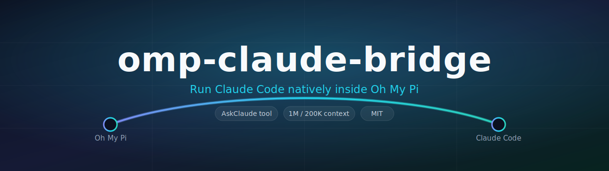
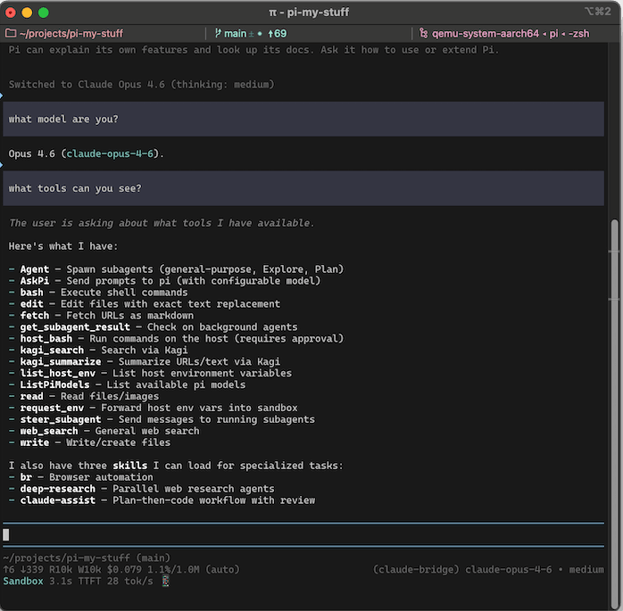
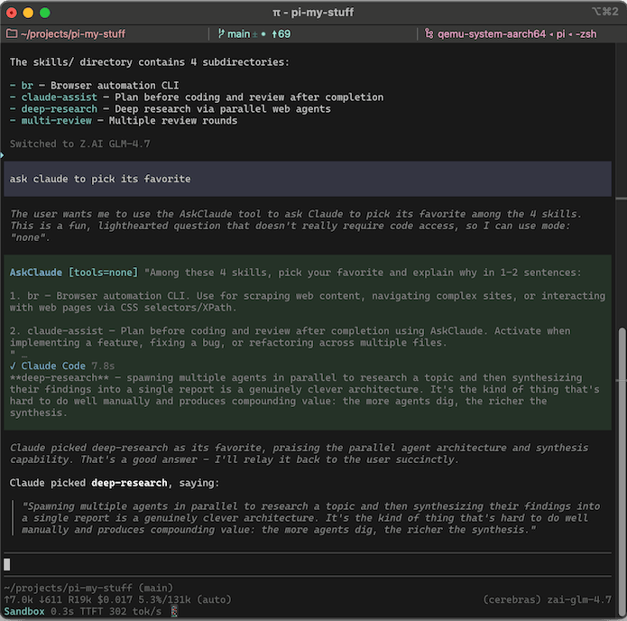

<div align="center">



<h1>omp-claude-bridge</h1>

<p><strong>Run Claude Code as a first-class model provider inside <a href="https://omp.sh">Oh My Pi</a> — with an AskClaude delegation tool and switchable 1M / 200K context windows.</strong></p>

<p>
<a href="LICENSE"></a>


<a href="https://github.com/DevVig/omp-claude-bridge/actions/workflows/ci.yml"></a>

</p>

</div>

---

`omp-claude-bridge` lets you drive **Claude Code** — Opus, Sonnet, Haiku, and Fable — from inside Oh My Pi, with every tool call flowing through OMP's native TUI. It also exposes an **AskClaude** tool so any other provider can delegate a task or a second opinion to Claude Code, and it gives you **direct control over the context window** each model requests.

Authentication and billing run through Claude Code and your Anthropic subscription via the official [Claude Agent SDK](https://github.com/anthropics/claude-agent-sdk-typescript) — this extension never stores credentials.

<div align="center">
<a href="assets/claude-bridge1.png"></a>&nbsp;
<a href="assets/claude-bridge2.png"></a>
</div>

## Table of contents

- [Features](#features)
- [Install](#install)
- [Quickstart](#quickstart)
- [Context window controls](#context-window-controls)
- [Models](#models)
- [AskClaude tool](#askclaude-tool)
- [Configuration reference](#configuration-reference)
- [How it works](#how-it-works)
- [Debugging](#debugging)
- [Development](#development)
- [Credits](#credits)
- [License](#license)

## Features

- **Claude Code as a provider** — pick Opus / Sonnet / Haiku / Fable from `/model`; tool calls render in OMP's TUI like any native provider.
- **AskClaude delegation tool** — from any other provider, hand a task or question to Claude Code (read-only, no-tools, or full read/write/bash), optionally in an isolated session.
- **Switchable context window** — force **1M** or **200K** globally, or leave it on measured per-model defaults. This is the headline addition in this fork.
- **Session resume & persistence** — conversations survive across turns and reconnects.
- **Skills + AGENTS.md forwarding** — your OMP skills and context files are passed into Claude Code's system prompt.
- **Thinking support** — effort levels map through to Claude Code, including `xhigh` on Sonnet models.
- **MCP tool bridging** with strict-config isolation by default.

## Install

```bash
omp plugin install git:github.com/DevVig/omp-claude-bridge
```

<details>
<summary>Other install methods</summary>

```bash
# From the full HTTPS URL
omp plugin install https://github.com/DevVig/omp-claude-bridge

# From a local checkout (great for hacking on it)
git clone https://github.com/DevVig/omp-claude-bridge.git
omp plugin install ./omp-claude-bridge
```

</details>

Requires Oh My Pi (`omp`) and a working Claude Code login.

## Quickstart

1. Install the plugin (above).
2. In OMP, run `/model` and choose a `claude-bridge/*` model — for example `claude-bridge/claude-sonnet-5`.
3. Work as usual. Tool calls run through OMP's TUI; Claude Code handles the model turn.

To delegate from another provider instead, just ask: *"Ask Claude to review this plan and poke holes in it."*

## Context window controls

Claude Code serves different context windows depending on the exact model id it receives (e.g. bare `claude-fable-5` serves 200K, while `claude-fable-5[1m]` serves 1M). `omp-claude-bridge` exposes both as **separate entries in the `/model` picker**, so you choose the window on demand:

- `claude-bridge/claude-opus-4-8` → **Opus 4.8 (1M)**
- `claude-bridge/claude-opus-4-8-200k` → **Opus 4.8 (200K)**

Switching window is just picking the other entry — no config edit, no reload. Every model appears once per window it supports, the `(1M)` / `(200K)` label is always shown, and each entry reports its true window so OMP's status bar and auto-compaction threshold stay accurate.

### Default window

The **unsuffixed** id (e.g. `claude-opus-4-8`) maps to a default window; the other window gets a `-1m` / `-200k` suffixed id. `provider.contextWindow` in `~/.omp/agent/claude-bridge.json` picks that default — it no longer hides models, it only decides which window is unsuffixed:

```json
{
  "provider": {
    "contextWindow": "auto"
  }
}
```

| Mode | Default (unsuffixed) window |
| ---- | -------- |
| `"auto"` *(default)* | Per-model measured default. Respects `plan` and `longContextExtraUsage`. |
| `"1m"` | 1M where the model has a 1M runtime, else its only window. |
| `"200k"` | 200K where the model has a 200K runtime, else its only window. |

Both windows stay in the picker regardless of this setting (wherever a runtime exists); it only changes which one is the plain, unsuffixed id. So `modelRoles` / `enabledModels` that reference `claude-bridge/claude-opus-4-8` keep working and follow the default.

### Windows offered per model

| Model | 200K entry | 1M entry | `auto` default |
| ----- | :--------: | :------: | :------------: |
| `claude-opus-4-8` | ✓ | ✓ | 1M |
| `claude-opus-4-7` | — | ✓ | 1M |
| `claude-opus-4-6` | ✓ | ✓ | 200K¹ |
| `claude-fable-5` | ✓ | ✓ | 200K |
| `claude-sonnet-5` | ✓ | ✓ | 1M |
| `claude-sonnet-4-6` | ✓ | ✓ | 200K² |
| `claude-haiku-4-5` | ✓ | — | 200K |

¹ Opus 4.6's `auto` default is 1M when `plan: "max"` or `longContextExtraUsage: true`.
² Sonnet 4.6's `auto` default is 1M when `longContextExtraUsage: true`.

The suffixed alternate exists only for the window that isn't the default — e.g. under `auto` you get `claude-opus-4-8` (1M) + `claude-opus-4-8-200k`, and under `"200k"` you get `claude-opus-4-8` (200K) + `claude-opus-4-8-1m`.

> Forcing 1M is a *request*: some models may still be **served** 200K by your subscription entitlement. Set `CLAUDE_BRIDGE_DEBUG=1` to log the served window (see [Debugging](#debugging)).

> An invalid `contextWindow` value logs a warning and falls back to `"auto"`, so a typo never breaks startup.

## Models

Pick any of these from `/model` — each entry shows a `(1M)` or `(200K)` label. The exact ids below assume the default `contextWindow: "auto"`; which id is unsuffixed vs `-1m` / `-200k` follows your configured [default window](#default-window).

| Picker id (auto) | Window |
| --------- | ------ |
| `claude-bridge/claude-fable-5` | 200K |
| `claude-bridge/claude-fable-5-1m` | 1M |
| `claude-bridge/claude-opus-4-8` | 1M |
| `claude-bridge/claude-opus-4-8-200k` | 200K |
| `claude-bridge/claude-opus-4-7` | 1M |
| `claude-bridge/claude-opus-4-6` | 200K (1M on Max / Extra Usage) |
| `claude-bridge/claude-opus-4-6-1m` | 1M |
| `claude-bridge/claude-sonnet-5` | 1M (supports `xhigh`) |
| `claude-bridge/claude-sonnet-5-200k` | 200K |
| `claude-bridge/claude-sonnet-4-6` | 200K (supports `xhigh`) |
| `claude-bridge/claude-sonnet-4-6-1m` | 1M |
| `claude-bridge/claude-haiku-4-5` | 200K (cheapest) |

Bash commands issued by Claude Code get a 120-second default timeout (matching Claude Code's default), since OMP's bash has no timeout by default.

## AskClaude tool

Available whenever the active provider is **not** claude-bridge. Your current model can hand work to Claude Code and wait for the result:

- "Ask Claude to plan a fix."
- "If you get stuck, ask Claude for help."
- "Ask Claude to review the plan in @foo.md, implement it, then ask an `isolated=true` Claude to review the implementation."
- "Ask Claude to poke holes in this theory."
- "Find all the places in the codebase that handle auth."

You can also bake it into a skill or AGENTS.md, e.g. *"Always call AskClaude to review complicated feature implementations before considering the task complete."*

### Parameters

| Parameter | Values | Description |
| --------- | ------ | ----------- |
| `prompt` | string | The question or task for Claude Code. |
| `mode` | `read` (default), `none`, `full` | `read` = read files + web; `full` = read/write/bash. Lock `full` out with `allowFullMode: false`. |
| `model` | `opus` (default), `sonnet`, `haiku`, or a full id | Which Claude model handles the delegation. |
| `thinking` | `off`, `minimal`, `low`, `medium`, `high`, `xhigh` | Effort level. |
| `isolated` | boolean (default `false`) | When `true`, Claude gets a clean session with no conversation history. |

## Configuration reference

Config is read from `~/.omp/agent/claude-bridge.json` (global) and the project OMP config directory `.omp/claude-bridge.json` (project; merged over global). A starter file lives at [`claude-bridge.example.json`](claude-bridge.example.json).

```json
{
  "askClaude": {
    "enabled": true,
    "allowFullMode": true,
    "defaultIsolated": false
  },
  "provider": {
    "contextWindow": "auto",
    "plan": "pro",
    "longContextExtraUsage": false,
    "strictMcpConfig": true
  }
}
```

**`askClaude`**

| Key | Default | Description |
| --- | ------- | ----------- |
| `enabled` | `true` | Register the AskClaude tool. |
| `name` | `"AskClaude"` | Override the tool's OMP-side name. |
| `label` | `"Ask Claude Code"` | Override the TUI label. |
| `description` | — | Override the tool description shown to the model. |
| `defaultMode` | `"read"` | `"read"`, `"none"`, or `"full"`. |
| `defaultIsolated` | `false` | Start each call in a fresh session. |
| `allowFullMode` | `true` | Allow `mode: "full"`; set `false` to lock it out. |
| `appendSkills` | `true` | Forward OMP's skills block into the system prompt. |

**`provider`**

| Key | Default | Description |
| --- | ------- | ----------- |
| `contextWindow` | `"auto"` | `"auto"`, `"1m"`, or `"200k"`. See [Context window controls](#context-window-controls). |
| `plan` | `"pro"` | Set to `"max"` to enable Opus 4.6 at 1M in `auto`. |
| `longContextExtraUsage` | `false` | Opt into metered 1M usage (enables Sonnet 4.6 1M everywhere, Opus 4.6 1M on Pro). |
| `appendSystemPrompt` | `true` | Append OMP's AGENTS.md and skills. |
| `settingSources` | — | Claude Code filesystem settings to load; only applied when `appendSystemPrompt: false`. |
| `strictMcpConfig` | `true` | Block MCP servers from `~/.claude.json` / `.mcp.json`. Cloud MCP is always blocked. |
| `pathToClaudeCodeExecutable` | — | Path to the `claude` binary, if the bundled one can't run on your OS/filesystem. |

## How it works

OMP's built-in tools are bridged to Claude Code and back, so from your side it behaves like any other OMP provider. Model routing lives in [`src/models.ts`](src/models.ts), which is deliberately free of runtime imports so the context-window policy stays unit-testable in isolation. On registration, the extension projects the pi-ai model list, applies the selected context-window policy, and registers the resulting models with OMP.

## Debugging

Set `CLAUDE_BRIDGE_DEBUG=1` for detailed logs:

- **Bridge log** — `~/.omp/agent/claude-bridge.log`: every provider call, session-sync decision, tool-result delivery, and Claude Code stderr. Override the path with `CLAUDE_BRIDGE_DEBUG_PATH`.
- **Per-query CLI logs** — `~/.omp/agent/cc-cli-logs/<timestamp>-<tag>-<seq>.log`: the Claude Code subprocess's own debug stream, one file per query. Tags are `provider`, `continuation`, or `askclaude`.

When filing a session-resume bug (e.g. "No conversation found"), the `syncResult:` lines from the bridge log plus the matching `cc-cli-logs/` file are the most useful attachments.

## Development

```bash
git clone https://github.com/DevVig/omp-claude-bridge.git
cd omp-claude-bridge
bun install

bun run typecheck   # tsc --noEmit
bun run test        # node --test unit suite
```

See [CONTRIBUTING.md](CONTRIBUTING.md) for the full workflow. CI runs typecheck and tests on every push and PR.

## Credits

- Original **[pi-claude-bridge](https://github.com/elidickinson/pi-claude-bridge)** by **[Eli Dickinson](https://github.com/elidickinson)** — the streaming provider, MCP/tool bridging, session resume, and AskClaude tool this project builds on.
- Initial inspiration from [claude-agent-sdk-pi](https://github.com/prateekmedia/claude-agent-sdk-pi) by Prateek Sunal.
- **Oh My Pi port and context-window controls** by **[Jonathan Borgwing](https://github.com/DevVig)**.

See [NOTICE](NOTICE) for full attribution.

> Anthropic [announced and then unannounced](https://support.claude.com/en/articles/15036540-use-the-claude-agent-sdk-with-your-claude-plan) a change to how Agent-SDK tool usage is billed. As of June 15, 2026 it uses your subscription quota just like Claude Code direct.

## License

[MIT](LICENSE) © 2026 Eli Dickinson (original) and Jonathan Borgwing (Oh My Pi port and context-window controls).
